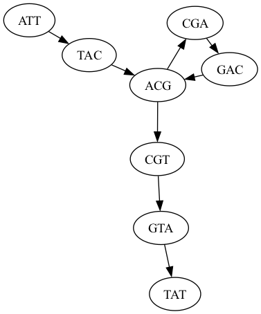
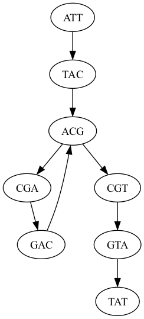

## Assignment 2: Genome Assembly
Assignment Date: Monday, September 9, 2024 <br>
Due Date: Monday, September 16, 2023 @ 11:59pm <br>

## Assignment Overview

In this assignment, you will explore the steps for de novo genome assembly. This will start with constructing and analyzing the de Bruijn graph of reads using a short python/R script. Next we will evaluate the expected and observed coverage in a set of reads. These reads come from a mysterious pathogen that contains a secret message encoded someplace in the genome. The secret message will be recognizable as a novel insertion of sequence not found in the reference. Your task is to assess the quality of the reads, assemble the genome, identify, and decode the secret message. If all goes well the secret message should decode into a recognizable english text, otherwise double check your coordinates and try again. As a reminder, any questions about the assignment should be posted to [Piazza](https://piazza.com/jhu/fall2024/600449600649/home).

For this assignment, we recommend you install and run the tools using [bioconda](https://www.nature.com/articles/s41592-018-0046-7). There are some tips below in the Resources section. Note on Mac, we highly recommend you install the x86_64 package even if you are using an M1/M2 chip.

### Question 1. de Bruijn Graph construction [10 pts]
- Q1a. Write a script (in python, R, C++, etc) to draw the de Bruijn graph for the following reads using k=3 (assume all reads are from the forward strand, no sequencing errors, complete coverage of the genome). You may find [graphviz](https://graphviz.org/) to be helpful (see below).

```
ATTCA
ATTGA
CATTG
CTTAT
GATTG
TATTT
TCATT
TCTTA
TGATT
TTATT
TTCAT
TTCTT
TTGAT
```

- Q1b. Assume that the maximum number of occurrences of any 3-mer in the actual genome is 4 using the k-mers from Q1a. Write one possible genome sequence. Note this genome sequence may include sequences that are not supported by the underlying reads (this is the well known read decoherency problem for genome assembly).

- Q1c. What would it take to fully resolve the genome? [In a few sentences]


#### Question 2. Coverage Analysis [20 pts]

Download the reads and reference genome from: [https://github.com/schatzlab/appliedgenomics2024/blob/main/assignments/assignment2/asm.tgz?raw=true](https://github.com/schatzlab/appliedgenomics2024/blob/main/assignments/assignment2/asm.tgz?raw=true)

Note we have provided both paired-end and mate-pairs reads (see included README for details). Make sure to look at all of the reads for the coverage analysis and kmer analysis, as well as in the assembly.

- Question 2a. How long is the reference genome? [Hint: Try `samtools faidx`]
- Question 2b. How many reads are provided and how long are they? Make sure to measure each file separately [Hint: Try `FastQC`]
- Question 2c. How much coverage do you expect to have? [Hint: A little arthmetic]
- Question 2d. Plot the average quality value across the length of the reads [Hint: Screenshot from `FastQC`]. Make 4 separate plots: frag1, frag2, mate1, mate2


#### Question 3. Kmer Analysis [20 pts]

Use `jellyfish` to count the 21-mers in the reads data (all reads should be counted together). Make sure to use the "-C" flag to count cannonical kmers, otherwise your analysis will not correctly account for the fact that your reads come from either strand of DNA.

- Question 3a. How many kmers occur exactly 50 times? [Hint: try `jellyfish histo`]
- Question 3b. What are the top 10 most frequently occurring kmers [Hint: try `jellyfish dump` along with `sort` and `head`]
- Question 3c. What is the estimated genome size based on the kmer frequencies? [Hint: upload the jellyfish histogram to [GenomeScope2](http://genomescope.org/genomescope2.0/) and report the min "Genome Haploid Length" in the "Results" section]
- Question 3d. How well does the GenomeScope genome size estimate compare to the reference genome? [Hint: In a sentence or two]

#### Question 4. De novo assembly [20 pts]

Assemble the reads using `spades`. Spades will *not* run on Windows, you must use a linux/mac environment (The Ubuntu subsystem might work?). The assembly should complete in ~1 minute.

Note: N50 size is the size such that half of the total amount of bases are in contigs this size or larger (a weighted median). For example, if you have contig sizes of 10kbp, 5kb, 3kbp, 1kbp, 1kbp, 1kbp. The total size is 21kbp. Half of this value is 10.5kbp, so the N50 size is 5kbp. To compute the N50 value, sort the contigs from largest to small, and then iterative through until their cummulative span reaches 50% of the total span.

- Question 4a. How many contigs were produced? [Hint: try `grep -c '>' contigs.fasta`]
- Question 4b. What is the total length of the contigs? [Hint: try `samtools faidx`, plus a short script/excel]
- Question 4c. What is the size of your large contig? [Hint: check `samtools faidx` plus `sort -n`]
- Question 4d. What is the contig N50 size? [Hint: Write a short script, or use excel]

#### Question 5. Finding and decoding the insertion [20 pts]
Use the `mummer` software tools to align your contigs to the reference genome. This will reveal all of the structural variants present, including the secret insertion. 

- Question 5a. How many insertions and deletions are in the assembly? [Hint: try `dnadiff`]
- Question 5b. What is the position of the insertion on the reference? [Hint: try `show-coords`]
- Question 5c. How long is the novel insertion? [Hint: try `show-coords`]
- Question 5d. What is the DNA sequence of the encoded message? [Hint: try `samtools faidx` to extract the insertion]
- Question 5e. What is the secret message? [Hint: run `dna-decode.py -d --input message.fa` to decode the string from 5c. If needed use the `--rev_comp` to reverse complement the sequence:]


## Packaging

The solutions to the above questions should be submitted as a single PDF document that includes your name, email address, and all relevant figures (as needed). If you use ChatGPT for any of the code, also record the prompts used. Submit your solutions by uploading the PDF to [GradeScope](https://www.gradescope.com/courses/839343), and remember to select where in your submission each question/subquestion is. The Entry Code is: Z3J8YV. 

If you submit after this time, you will use your late days. Remember, you are only allowed 4 late days for the entire semester!


## Resources

#### [Bioconda](https://bioconda.github.io/) - Package manager for bioinformatics software

On linux or mac I *highly* recommend that you use bioconda to install the packages rather than installing from source. 

The easiest way to install conda is with [Miniconda](https://docs.conda.io/en/latest/miniconda.html). For M1 macs, you must use the x86 installation in emulation mode since  M1/arm support is still limited. For this you will use the "Rosette 2" subsystem that will convert M1 arm instructions into x86_64 on the fly. Rosette will be automatically installed when you go to run it. I also recommend using [mamba](https://github.com/mamba-org/mamba) instead of the default `conda` command for installing new packages:

```
## Replace MacOS-x86_64 with the version you downloaded from https://github.com/conda-forge/miniforge#mambaforge
$ chmod +x ./Mambaforge-MacOSX-x86_64.sh
$ ./Mambaforge-MacOSX-x86_64.sh

## After mamba is installed add bioconda as a default channel
$ conda config --add channels conda-forge
$ conda config --add channels defaults
$ conda config --add channels bioconda
$ conda config --set channel_priority strict
```

Once bioconda is configured, all of the tools needed for this assignment except spades can be installed using:

```
$ mamba install samtools bowtie bwa mummer4 jellyfish fastqc fastx_toolkit graphviz
```

For spades, download the precompiled version from here (installing with conda is tricky because there are conflicts in the dependencies):
[https://github.com/ablab/spades/releases/tag/v4.0.0](https://github.com/ablab/spades/releases/tag/v4.0.0)


### Graphview Tips

It is very easy to render a graph using graphviz. Install with `mamba install graphviz`. For example, these commands will render [graph.dot](graph.dot) using `neato`:

```
$ cat graph.dot
digraph{
    ATT -> TAC
    TAC -> ACG
    ACG -> CGA
    CGA -> GAC
    GAC -> ACG
    ACG -> CGT
    CGT -> GTA
    GTA -> TAT
}
```

```$ neato -T png graph.dot -o neato.png```



Alternatively use `dot`

```$ dot -T png graph.dot -o dot.png```




#### [FastQC](http://www.bioinformatics.babraham.ac.uk/projects/fastqc/) - Raw read quality assessment

```
$ fastqc /path/to/reads.fq
```

If you have problems, make sure java is installed (`sudo apt-get install default-jre`)


#### [Jellyfish](http://www.genome.umd.edu/jellyfish.html) - Fast Kmer Counting

When counting kmers, make sure to count "canonical" kmers on both strands (-C):

```
$ jellyfish count -m 21 -C -s 1000000 /path/to/reads*.fq
$ jellyfish histo mer_counts.jf > reads.histo
```

#### [GenomeScope](http://www.genomescope.org/) - Analyze Kmer Profile to determine genome size and other properties

GenomeScope is a web-based tool so there is nothing to install. Hooray! Just make sure to use the `-C` when running jellyfish count so that the reads are correctly processed.

####  [Spades](https://github.com/ablab/spades) - Short Read Assembler. 

Normally spades would try several values of k and merge the results together, but here we will force it to just use k=31 to save time. The assembly should take a few minutes.

```
$ spades.py --isolate --pe1-1 frag180.1.fq --pe1-2 frag180.2.fq --mp1-1 jump2k.1.fq --mp1-2 jump2k.2.fq -o asm -t 4 -k 31
```


***Note: On mac you may need to run spades like this with the -m flag:***
```
$ spades.py --isolate -m 1024 --pe1-1 frag180.1.fq --pe1-2 frag180.2.fq --mp1-1 jump2k.1.fq --mp1-2 jump2k.2.fq -o asm -t 4 -k 31
```


#### [MUMmer4](https://github.com/mummer4/mummer) - Whole Genome Alignment

```
$ dnadiff /path/to/ref.fa /path/to/qry.fa
$ nucmer /path/to/ref.fa /path/to/qry.fa
$ show-coords out.delta
```

**WARNING: nucmer and related tools do not like it if/when you have spaces or special characters ('@') in the path to the binaries***


#### [SAMTools](http://www.htslib.org/) - Extract part of a genome sequence using 'samtools faidx' (this will extract from contig_id bases 1234 through 5678)

```
$ ./samtools faidx /path/to/genome.fa contig_id:1234-5678
```
